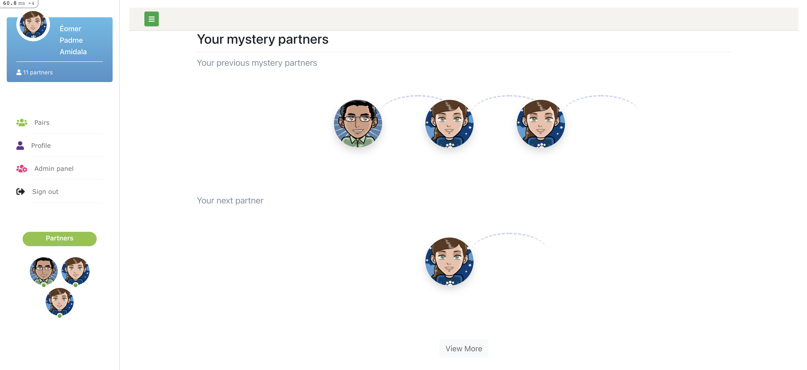

# Mystery lunch matching application

# How to run

1. Build docker images with docker compose
```bash
docker-compose build
docker-compose up # this will create required containers but fails
```

2. Install libraries
```bash
docker-compose run --rm rails bundle install
docker-compose run --rm rails yarn install
```

3. Prepare db
In a different terminal, run the following:

```bash
docker-compose run --rm rails bundle exec rails db:create
docker-compose run --rm rails bundle exec rails db:migrate
docker-compose run --rm rails bundle exec rails db:seed
```

After seeding completed admin username and password will be displayed place take memo for that
Or if you missed that part you can covert one normal user to admin user with following command
```bash
docker-compose run --rm rails bundle exec rails console
User.first.admin!
User.first.username
# All seed users password is same as !QAZ2wsx
```

1. Run web service
Once you run all required tasks you able to run rails development environment on docker.
```bash
docker-compose up
```

# Matching logic

Matching logic is select users based on users possible connection with other users.
It will start to choose users from lowest connection of users. And this will prepend to user
stay without selection.

Logic complexity is O(n^2) which loop all N numbers users twice. 

More about: app/services/mystery_matcher.rb

**Benchmark test**


1000 users

```bash
                    user     system      total        real
Mystery matching  0.742561   0.008291   0.750852 (  0.754114)
                  0.742561   0.008291   0.750852 (  0.754114)
```

10_000 users

```bash
       user     system      total        real
Mystery matching
      74.757023   1.552273  76.309296 ( 77.806297)
      74.757023   1.552273  76.309296 ( 77.806297)
```

### How it runs

Sidekiq scheduled job will run it every first day of each month at 00:00.
Configuration: config/sidekiq.yml
Data will be stored into MysteryPair table as self joined table.

# Web service

Mystery lunch web service will be devided as 3 parts

1. Landing page: (home/index)
   Landing page uses JS webpacker with Vue option. This will allow to us dynamic single landing page includes
   Home, Contact or some other pages. (Not completed)
2. User panel: (/users) 
   User panel proteced by Devise password authentication. http://localhost:3002/users/sign_in
   User can check his/her previous main page of user. http://localhost:3002/users
   
   Also you can able to change your personal data expect your "department". Only admin can change your department.
3. Admin panel (/admin/users, /admin/dashboard/index)
   From dashboard page you can check number of user, department and each departments matching progress.
   Also you can filter progress by "department name"
   
   From user page you can do CRUD action for user
   

# Work in progress

1. Homepage
- Display the current mystery partners  - _Back-end side feature is ready, only need to show next partner of next month_
- For every employee, display: photo, name and department name - _Done._
- Filter by department - _Works in admin/dashboard. But also need to add into admin/users page_
- Allow the user to see all mystery partners from previous months - _Done. user/index page will show all previous partners_
2. Employees management
- Restricted area (requires authentication) - _Done._
- Manage employees (index, display, create, edit and delete) - _Done._
- Departments: operations, sales, marketing, risk, management, finance, HR, development and data - _Done, whitelisted logic_
- The employee deletion should only disable the employee for future mystery lunches - _Done. User will be suspended, not physically deleted from DB_
- When an employee is created, he/she should join an existing mystery pair (3 people mystery lunch) - _Done. will add new user when user created_
- When an employee is deleted:
      - This employee had one mystery partner: the remaining employee should join another existing mystery pair (3 people mystery lunch) - _Done._
      - This employee had two mystery partners: nothing should be done - _Done._
1. Mystery partners selection
Must have
- The selection should be automatically performed on 1st day of each month  - _Done._
- Two employees should not be selected to be partners if they were partners in the last 3 months  - _Done._
- When the number of employees is odd, the remaining employee should join an existing mystery pair (3 people mystery lunch). The department of these three employees should be different. - _Done._
- Automated tests - _Work In Progress_
- Use your creativity and build a new feature of your choice _Work In Progress_

# Things TODO (current status: 70%) and Priority
1. Finish all controller request tests - VeryHigh
2. Add scheduled job test - VeryHigh
3. Add more corner tests for MysteryMatcher - VeryHigh
4. ~~Add suspension logic for user deletion - VeryHigh~~
   ~~User has status (active and suspended), MysteryPairFinderWorker only selecting active users.~~
   ~~So, I need to convert "deletion" logic to "suspension logic"~~
5. Add new end-point for admin panel that show and filter Matching data - High
6. ~~Add logic for `When an employee is created, he/she should join an existing mystery pair (3 people mystery lunch)` and~~
   ~~call it admin creates new user and user register by himself.~~
7. Add JS landing page (home/index) - High
8. ~~Fix "Matching logic" BUGFIX mentioned above - High~~
9.  Add search panel for Admin users list (admin/users/index) - High
10. Remove duplication of users page for admin and users - Low
11. Add admin feature that convert normal user to admin user - Low
12. Resolve CSS duplication - Low

# Refferences

1. UI: https://www.bootdey.com/
2. Ruby, Ruby and Rails API documents
3. Each GEM wiki pages
4. Rails 6 release note
5. Docker and Docker compose official documents
